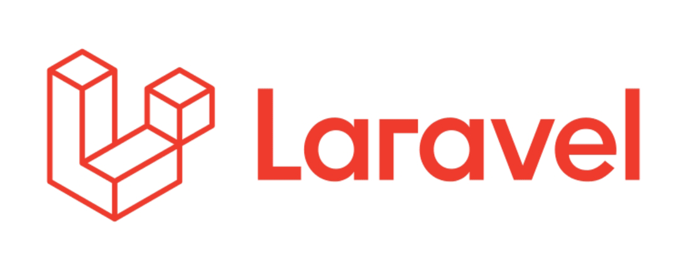

# Hi, I'm Kevin Alnizar - [kevinXcode](https://kevinxcode.github.io/) 👋

- 👀 I’m interested in Software Enggineer 
- 🌱 I’m currently learning everything 😅
- 🌱 I’m currently learning React Native
- 💞️ I’m looking to collaborate on Software Enggineer

## Connect with me
- 📫 How to reach me in Linkedin: https://www.linkedin.com/in/kevinalnizar/ 
- 📫 Project : https://fadeintech.com/
- 📫 Portofolio : https://kevinxcode.github.io/

## Languages and Tools

<!---
kevinxcode/kevinxcode is a ✨ special ✨ repository because its `README.md` (this file) appears on your GitHub profile.
You can click the Preview link to take a look at your changes.
--->
